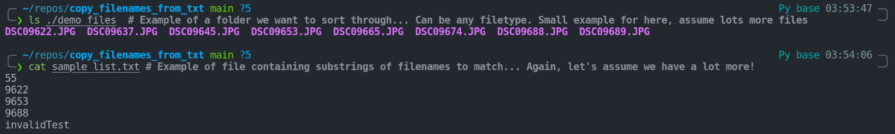
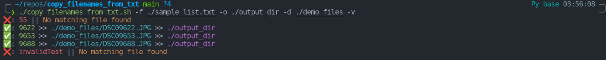
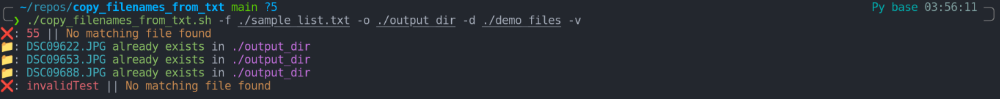

# Copy Filenames from `.txt` Document
[![made-with-bash](https://img.shields.io/badge/-Made%20with%20Bash-1f425f.svg?style=plastic&logo=image%2Fpng%3Bbase64%2CiVBORw0KGgoAAAANSUhEUgAAABgAAAAYCAYAAADgdz34AAAAGXRFWHRTb2Z0d2FyZQBBZG9iZSBJbWFnZVJlYWR5ccllPAAAAyZpVFh0WE1MOmNvbS5hZG9iZS54bXAAAAAAADw%2FeHBhY2tldCBiZWdpbj0i77u%2FIiBpZD0iVzVNME1wQ2VoaUh6cmVTek5UY3prYzlkIj8%2BIDx4OnhtcG1ldGEgeG1sbnM6eD0iYWRvYmU6bnM6bWV0YS8iIHg6eG1wdGs9IkFkb2JlIFhNUCBDb3JlIDUuNi1jMTExIDc5LjE1ODMyNSwgMjAxNS8wOS8xMC0wMToxMDoyMCAgICAgICAgIj4gPHJkZjpSREYgeG1sbnM6cmRmPSJodHRwOi8vd3d3LnczLm9yZy8xOTk5LzAyLzIyLXJkZi1zeW50YXgtbnMjIj4gPHJkZjpEZXNjcmlwdGlvbiByZGY6YWJvdXQ9IiIgeG1sbnM6eG1wPSJodHRwOi8vbnMuYWRvYmUuY29tL3hhcC8xLjAvIiB4bWxuczp4bXBNTT0iaHR0cDovL25zLmFkb2JlLmNvbS94YXAvMS4wL21tLyIgeG1sbnM6c3RSZWY9Imh0dHA6Ly9ucy5hZG9iZS5jb20veGFwLzEuMC9zVHlwZS9SZXNvdXJjZVJlZiMiIHhtcDpDcmVhdG9yVG9vbD0iQWRvYmUgUGhvdG9zaG9wIENDIDIwMTUgKFdpbmRvd3MpIiB4bXBNTTpJbnN0YW5jZUlEPSJ4bXAuaWlkOkE3MDg2QTAyQUZCMzExRTVBMkQxRDMzMkJDMUQ4RDk3IiB4bXBNTTpEb2N1bWVudElEPSJ4bXAuZGlkOkE3MDg2QTAzQUZCMzExRTVBMkQxRDMzMkJDMUQ4RDk3Ij4gPHhtcE1NOkRlcml2ZWRGcm9tIHN0UmVmOmluc3RhbmNlSUQ9InhtcC5paWQ6QTcwODZBMDBBRkIzMTFFNUEyRDFEMzMyQkMxRDhEOTciIHN0UmVmOmRvY3VtZW50SUQ9InhtcC5kaWQ6QTcwODZBMDFBRkIzMTFFNUEyRDFEMzMyQkMxRDhEOTciLz4gPC9yZGY6RGVzY3JpcHRpb24%2BIDwvcmRmOlJERj4gPC94OnhtcG1ldGE%2BIDw%2FeHBhY2tldCBlbmQ9InIiPz6lm45hAAADkklEQVR42qyVa0yTVxzGn7d9Wy03MS2ii8s%2BeokYNQSVhCzOjXZOFNF4jx%2BMRmPUMEUEqVG36jo2thizLSQSMd4N8ZoQ8RKjJtooaCpK6ZoCtRXKpRempbTv5ey83bhkAUphz8fznvP8znn%2B%2F3NeEEJgNBoRRSmz0ub%2FfuxEacBg%2FDmYtiCjgo5NG2mBXq%2BH5I1ogMRk9Zbd%2BQU2e1ML6VPLOyf5tvBQ8yT1lG10imxsABm7SLs898GTpyYynEzP60hO3trHDKvMigUwdeaceacqzp7nOI4n0SSIIjl36ao4Z356OV07fSQAk6xJ3XGg%2BLCr1d1OYlVHp4eUHPnerU79ZA%2F1kuv1JQMAg%2BE4O2P23EumF3VkvHprsZKMzKwbRUXFEyTvSIEmTVbrysp%2BWr8wfQHGK6WChVa3bKUmdWou%2BjpArdGkzZ41c1zG%2Fu5uGH4swzd561F%2BuhIT4%2BLnSuPsv9%2BJKIpjNr9dXYOyk7%2FBZrcjIT4eCnoKgedJP4BEqhG77E3NKP31FO7cfQA5K0dSYuLgz2TwCWJSOBzG6crzKK%2BohNfni%2Bx6OMUMMNe%2Fgf7ocbw0v0acKg6J8Ql0q%2BT%2FAXR5PNi5dz9c71upuQqCKFAD%2BYhrZLEAmpodaHO3Qy6TI3NhBpbrshGtOWKOSMYwYGQM8nJzoFJNxP2HjyIQho4PewK6hBktoDcUwtIln4PjOWzflQ%2Be5yl0yCCYgYikTclGlxadio%2BBQCSiW1UXoVGrKYwH4RgMrjU1HAB4vR6LzWYfFUCKxfS8Ftk5qxHoCUQAUkRJaSEokkV6Y%2F%2BJUOC4hn6A39NVXVBYeNP8piH6HeA4fPbpdBQV5KOx0QaL1YppX3Jgk0TwH2Vg6S3u%2BdB91%2B%2FpuNYPYFl5uP5V7ZqvsrX7jxqMXR6ff3gCQSTzFI0a1TX3wIs8ul%2Bq4HuWAAiM39vhOuR1O1fQ2gT%2F26Z8Z5vrl2OHi9OXZn995nLV9aFfS6UC9JeJPfuK0NBohWpCHMSAAsFe74WWP%2BvT25wtP9Bpob6uGqqyDnOtaeumjRu%2ByFu36VntK%2FPA5umTJeUtPWZSU9BCgud661odVp3DZtkc7AnYR33RRC708PrVi1larW7XwZIjLnd7R6SgSqWSNjU1B3F72pz5TZbXmX5vV81Yb7Lg7XT%2FUXriu8XLVqw6c6XqWnBKiiYU%2BMt3wWF7u7i91XlSEITwSAZ%2FCzAAHsJVbwXYFFEAAAAASUVORK5CYII%3D)](https://www.gnu.org/software/bash/)

`bash` CLI tool to recursively copy files whose name contains (partially) entries in a `.txt` file.

An output directory, search directory and file containing the sub-strings to match each filename to can all be passed.

## Setup/Installation/How to use
* `git clone` this repo to somewhere you want to store the bash script
* `chmod u+x ./copy_filenames_from_txt.sh` make the script executable
* Use away!

## But Why Though?
* You're working with a bunch of files (images in my example).
    * You've made a selection and have a list of filenames (or partial/substrings from filenames)
* You don't want to go through like a chump clicking manually on each one.
* Solution: This `bash` tool.
    * Simple to run.
    * Handles the case where more than one file matches the sub-string.
    * Only the files that match lines in the supplied input file will be copied.
    * Will not overwrite or remove data.
    * Supports local and absolute paths.

## Demo Example
[](https://asciinema.org/a/531445)

## Screenshots
### File Setup


### Copying Files


### Files Already Exist



## Usage Example
### Help Output [CLI]
```bash
Batch copy helper. Recursively search a directory for all filenames containing a sub-string based on an input file.
Uses an input file with each line containing a sub-string to search for.

Syntax: copy_filenames_from_txt.sh [-v|h] [-f file|-d dir|-o dir]
options:
-f     File with desired sub-strings of filenames to copy. Usually .txt. Each search string on new line.
-d     Search directory. Will be recursively searched for any matches in -f. Usually ./ (if cd is desired directory).
-o     Output directory. To copy all matching files to. Note: will be created if does not exist.
-V     Display Version string: 0.0.1.
-h     Display this Help.
-v     Verbose prints.
```

## Notes
* Quick personal project to play around with `bash`
* Feel free to comment or make changes
* I have only tested with a `.txt` file as the `-f` input file parameter.
    * Should probably work with other file types that can be read by `UNIX`.
* I have assumed all input files will be use a new line as a delimiter.
    * Could look into this in the future...
* I have only tested this locally on a Linux container.

## TODO
* Testing
* Loading bar or indicator
* Improve name
* Handle other delimiter
